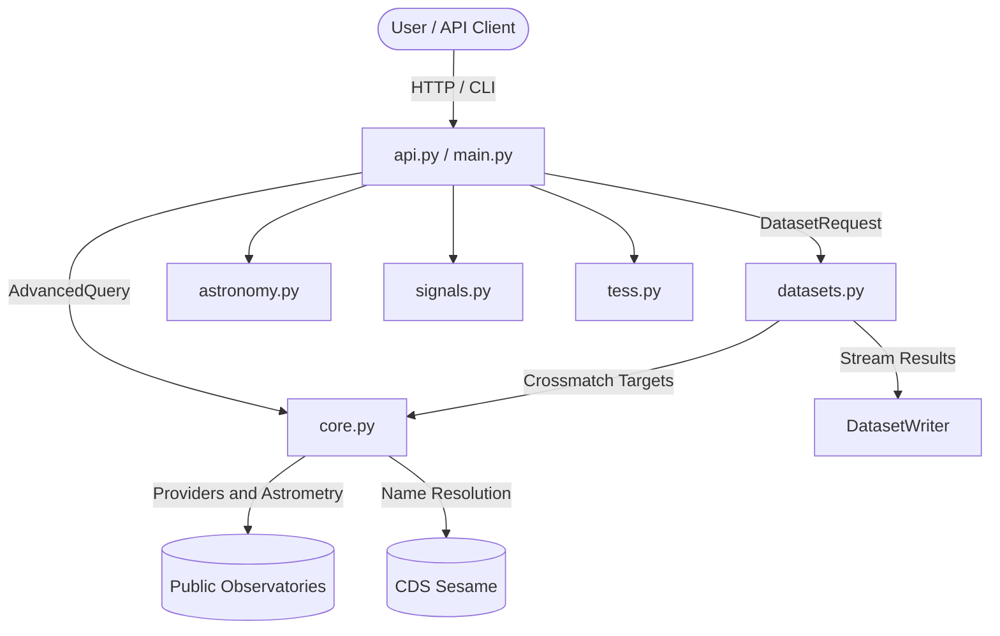

# AstroSearch Technical Documentation

AstroSearch is an astronomical catalog cross-matching engine, summary service, TESS light-curve retriever, and multi-format dataset generator built in Python. This document describes the implemented backend, its media/rendering boundary, frontend integration contracts, and operational limits.

---

## Table of Contents
1. [Architecture Overview](#1-architecture-overview)
2. [Catalog Registry Inventory](#2-catalog-registry-inventory)
3. [Query DSL & Astrometric Engine](#3-query-dsl--astrometric-engine)
4. [Streaming Dataset Pipeline & Storage](#4-streaming-dataset-pipeline--storage)
5. [HTTP REST API Reference](#5-http-rest-api-reference)
6. [Media, Plotting & Frontend Integration](#6-media-plotting--frontend-integration)
7. [Building Larger Datasets](#7-building-larger-datasets)
8. [Security, Quotas & Resilience](#8-security-quotas--resilience)
9. [Operations & Environment Configuration](#9-operations--environment-configuration)

---

## 1. Architecture Overview

The runtime is organized into seven Python modules. `core.py` consolidates the catalog models, archive providers, and crossmatch engine. The remaining modules group dataset operations, the API/CLI, and the astronomy, signal, and TESS workflows.

```
AstroSearch/
|-- core.py       # Models, parsers, providers, query planning, and crossmatching
|-- datasets.py   # Streaming exports, metadata/storage, and background jobs
|-- api.py        # REST routes, schemas, authentication, quotas, and metrics
|-- main.py       # Programmatic facade and unified CLI
|-- astronomy.py  # Summaries, snapshots, Mantis publication, and catalog plots
|-- signals.py    # Representations, signal ingestion/cross-reference, and plots
`-- tess.py       # TESS FITS adapter, MAST service/cache, and retrieval CLI
```

The Mantis Observatory extension directory contains a manifest and README only; no panel source or built panel is present. Python modules and CLIs run on the backend and are not browser imports.

### Module Interactions & Data Flow



## 2. Catalog Registry Inventory

The built-in registry (`core.py: DEFAULT_CATALOGS`) declares 16 catalog definitions across five provider adapters. Fifteen are enabled by default; `vizier_2mass_reference` is present but disabled. `GET /api/v1/catalogs` returns definitions including disabled entries.

Search profiles select catalog groups; `full` covers the 15 catalogs enabled by default. A search can also name an explicit `catalogs` list. It returns catalog detections, scalar measurements, provenance, and outbound links; it does not return the raw archive files behind those links.

| Catalog ID | Provider | Wavelength | Protocol / Method | Primary Table / Catalog | Default Profiles |
|---|---|---|---|---|---|
| `gaia_dr3` | `tap` | Optical | ADQL Cone Search | `gaiadr3.gaia_source` | `full`, `optical`, `stellar` |
| `simbad` | `tap` | Multi | ADQL Positional Query | `basic` | `full`, `optical`, `stellar`, `identity` |
| `ned` | `tap` | Extragalactic | ADQL Positional Query | `objdir` | `full`, `optical`, `extragalactic`, `identity` |
| `exoplanet_archive` | `tap` | Exoplanet | ADQL Positional Query | `ps` | `full`, `exoplanet`, `stellar` |
| `vizier_2mass_reference` | `tap` | Infrared | ADQL Cone Search | `II/246/out` | `full`, `infrared`, `stellar` (disabled) |
| `twomass_psc` | `irsa_gator` | Infrared | IPAC ASCII Cone Search | `fp_psc` | `full`, `infrared`, `stellar` |
| `allwise` | `irsa_gator` | Infrared | IPAC ASCII Cone Search | `allwise_p3as_psd` | `full`, `infrared`, `stellar` |
| `panstarrs_dr2` | `mast` | Optical | Positional REST API | Mean Object Catalog | `full`, `optical`, `extragalactic` |
| `sdss` | `sdss` | Optical | CSV SkyServer Cone | PhotoObj / Primary | `full`, `optical`, `extragalactic`, `spectroscopy` |
| `first` | `heasarc_xamin` | Radio | Xamin Positional Search | `first` (1.4 GHz) | `full`, `radio`, `extragalactic` |
| `nvss` | `heasarc_xamin` | Radio | Xamin Positional Search | `nvss` (1.4 GHz all-sky) | `full`, `radio`, `extragalactic` |
| `vlass` | `heasarc_xamin` | Radio | Xamin Positional Search | `vlass` (3 GHz) | `full`, `radio`, `extragalactic` |
| `lotss` | `heasarc_xamin` | Radio | Xamin Positional Search | `lotss` (120-168 MHz) | `full`, `radio`, `extragalactic` |
| `rosat` | `heasarc_xamin` | X-ray | Xamin Positional Search | `rosmaster` | `full`, `xray`, `high-energy` |
| `chandra` | `heasarc_xamin` | X-ray | Xamin Positional Search | `chandra` (CSC) | `full`, `xray`, `high-energy` |
| `xmm` | `heasarc_xamin` | X-ray | Xamin Positional Search | `xmm` (4XMM) | `full`, `xray`, `high-energy` |

---

## 3. Query DSL & Astrometric Engine

The search engine accepts either explicit sky coordinates or astronomical object names and evaluates complex geometric, astrophysical, and temporal constraints.

### Coordinate Astrometry & Epoch Propagation
- **Right Ascension / Declination**: RA is normalized to $[0^\circ, 360^\circ)$ and Dec is validated within $[-90^\circ, 90^\circ]$.
- **Proper Motion Correction**: If target epoch $t$ and source epoch $t_0$ are defined with proper motions $(\mu_{\alpha*}, \mu_{\delta})$, AstroSearch propagates coordinates via Astropy's `SkyCoord.apply_space_motion`:
  $$\text{coord}(t) = \text{coord}(t_0) + \Delta t \cdot (\mu_{\alpha*}, \mu_{\delta})$$
- **Separation & Match Confidence**: Angular separation $\theta$ is computed via spherical trigonometry. Probabilistic confidence $C$ is computed using Gaussian positional uncertainties $\sigma = \sqrt{\sigma_{\text{source}}^2 + \sigma_{\text{target}}^2}$:
  $$C = \exp\left( -0.5 \left(\frac{\theta}{\sigma}\right)^2 \right)$$

### Search Modes & Filters
1. **`cone` Mode**: Standard spherical cone search within $\theta \le r_{\text{max}}$.
2. **`shell` Mode**: Annular ring search where $r_{\text{min}} \le \theta \le r_{\text{max}}$.
3. **`cylinder` Mode**: 3D spatial cylinder filtering by distance bounds $[d_{\text{min}}, d_{\text{max}}]$ in parsecs. For sources with parallax $\varpi$ (in mas), distance is derived as:
   $$d = \frac{1000}{\varpi} \text{ pc}$$
4. **Adaptive Radius**: When enabled, if dense clustering is detected, the search radius is dynamically scaled to $1.5 \times \text{median}(\theta_{1\dots 5})$ to eliminate field contamination.
5. **Spatial Exclusion Polygons**: Point-in-polygon ray-casting filters out exclusion zones while handling $0^\circ / 360^\circ$ RA wrap-around.
6. **Object Type Canonicalization**: Maps raw archive designations (`*`, `G`, `QSO`, `cl*`) to canonical classifications (`star`, `galaxy`, `quasar`, `star_cluster`, `nebula`).
7. **Disjoint-Set Union (DSU) Grouping**: Detections across all queried catalogs are clustered into coherent physical astrophysical objects (`object-1`, `object-2`, etc.) based on mutual positional consistency within allowable positional error bubbles.

---

## 4. Streaming Dataset Pipeline & Storage

The dataset generation engine in `datasets.py` supports legacy detection exports and reusable object fulfillment. Adding `count` selects fulfillment: canonical records are checked first, missing coverage is fetched in provider tasks, and selected objects are materialized separately. Legacy requests retain their format/schema defaults and seed the canonical store for later requests.

### Streaming Multi-Format Exports
- **Parquet (`.parquet`)**: Writes PyArrow tables in batches of 1,000 rows with `zstd` compression. The writer buffer is chunked, but dataset deduplication keeps a set of every unique `(catalog, source_id)` and the job collects failures in memory.
- **JSON (`.json`)**: Writes a bracketed JSON array incrementally.
- **JSONL (`.jsonl`)**: Streams one record per line and preserves nested products and arrays.
- **CSV (`.csv`)**: Standard delimited tabular format with serialized JSON sub-dictionaries.
- **FITS (`.fits`)**: Astropy binary table HDU format for astronomical tools (SAOImageDS9, TOPCAT); rows are buffered until the file is written, so FITS has a larger memory footprint.

Legacy TAP searches retain `TOP 100`. Fulfillment uses bounded keyset pages ordered by the registry source identifier. Default pages are 1,000 for Gaia and 250 for other TAP catalogs; requested deficits can reduce these. Non-TAP adapters retain their existing cone-search capabilities. HTTP catalog bodies are bounded during transfer (10 MB default); SDK product bodies default to 128 MiB. See section 7 for partitioning and memory limits.

### Storage Backends
- **Metadata Store (`MetadataStore`)**: Stores job states (`queued`, `running`, `completed`, `partial`, `failed`), canonical sources/products, task leases/checkpoints, scan cursors, manifests, and saved queries. Supports local SQLite (`metadata.sqlite3`) and optional PostgreSQL via `DATABASE_URL`.
- **Object Store (`ObjectStore`)**: Supports AWS S3 and MinIO via `boto3`. Exported files can be streamed directly to cloud buckets.

### Asynchronous Worker Architecture
Dataset creation jobs run asynchronously. With `REDIS_URL`, the existing `datasets` RQ queue runs orchestrators. Otherwise, the API uses local background tasks. `DATASET_EXECUTION_MODE=rq` additionally dispatches individual provider shards to `archive:<provider>` queues. Redis is optional for local usage. Shared storage and the same registry/configuration are required across distributed workers.

---

## 5. HTTP REST API Reference

The service runs on FastAPI and exposes an interactive OpenAPI Swagger interface at `/api/docs`.

### 1. Health & Catalogs

#### `GET /api/v1/health`
Returns system health status and UTC timestamp.
```json
{
  "status": "healthy",
  "timestamp": "2026-09-20T04:15:00.000000Z",
  "version": "0.2.0"
}
```

#### `GET /api/v1/catalogs`
Returns catalog definitions, including the disabled VizieR 2MASS definition.

#### `GET /api/v1/catalogs/{catalog_name}`
Returns details of a specific catalog (e.g., `gaia_dr3`, `simbad`, `allwise`).

---

### 2. Crossmatch Search

#### `POST /api/v1/search`
Execute crossmatch by coordinates or object name.

**Request Payload:**
```json
{
  "ra": 187.705930,
  "dec": 12.391123,
  "radius_arcsec": 5.0,
  "profile": "optical",
  "object_types": ["galaxy"],
  "min_confidence": 0.8,
  "search_mode": "cone",
  "proper_motion": true,
  "max_results": 10
}
```

*Alternatively, search by object name:*
```json
{
  "name": "M87",
  "radius_arcsec": 5.0,
  "profile": "optical"
}
```

**Response Payload (`UnifiedRecord`):**
```json
{
  "target": { "ra": 187.70593, "dec": 12.391123, "frame": "icrs" },
  "catalogs_queried": 6,
  "catalog_results": { ... },
  "counterparts": {
    "optical": [
      {
        "catalog": "gaia_dr3",
        "source_id": "3920194829102",
        "ra": 187.705928,
        "dec": 12.391122,
        "separation_arcsec": 0.0075,
        "confidence": 0.9998,
        "physical": { "object_type": "galaxy", "redshift": 0.00428 }
      }
    ]
  },
  "failures": [],
  "crossmatch_groups": [
    {
      "group_id": "object-1",
      "catalogs": ["gaia_dr3", "simbad"],
      "wavelengths": ["optical", "multi"],
      "members": [ ... ]
    }
  ],
  "provenance": {
    "query_radius_arcsec": 5.0,
    "effective_radius_arcsec": 5.0,
    "matches": [ ... ]
  }
}
```

#### `POST /api/v1/search/batch`
Executes an array of `SearchRequest` objects concurrently with `max_concurrent` query parameter control.

### 3. Astronomy summaries and signal cross-reference

#### `POST /api/v1/summaries/object`
Runs a catalog crossmatch from a `SearchRequest` and summarizes the returned evidence. It uses existing catalog results; it does not retrieve image or spectrum files.

#### `POST /api/v1/summaries/system`
Accepts `{"name":"TRAPPIST-1"}` and returns an evidence-based extrasolar-system summary using the astronomy service and its configured archive sources.

#### `POST /api/v1/signals/cross-reference`
Accepts a canonical one-dimensional light-curve or spectrum observation plus an optional reference list. It builds a representation, ranks references, and returns candidate novelty triage. This route processes supplied data; it does not fetch a spectrum or light curve from an archive.

---

### 4. Datasets

#### `POST /api/v1/datasets/create`
Submits an asynchronous dataset creation job. Returns `HTTP 202 Accepted` with a `Location` header.

**Request Payload:**
```json
{
  "name": "virgo_cluster_galaxies",
  "profile": "extragalactic",
  "radius_arcsec": 10.0,
  "object_types": ["galaxy"],
  "count_threshold": 2,
  "export_format": "parquet",
  "targets": [
    { "ra": 187.70593, "dec": 12.39112 },
    { "ra": 186.45360, "dec": 12.88699 }
  ]
}
```

**Response (HTTP 202):**
```json
{
  "id": "7f8b9a1c2d3e4f5a6b7c8d9e0f1a2b3c",
  "name": "virgo_cluster_galaxies",
  "profile": "extragalactic",
  "status": "queued",
  "total_sources": 0,
  "output_format": "parquet",
  "created_at": "2026-09-20T04:15:00.000000Z"
}
```

#### `GET /api/v1/datasets`
List all created datasets with statuses (`queued`, `running`, `completed`, `failed`).

#### `GET /api/v1/datasets/{dataset_id}`
Get metadata, total source count, and status for a specific dataset.

#### `GET /api/v1/datasets/{dataset_id}/export`
Download the exported file (`.parquet`, `.csv`, `.json`, or `.fits`).

#### `DELETE /api/v1/datasets/{dataset_id}`
Deletes dataset record from metadata database and removes the file from local storage / S3.

---

### 5. Saved Queries & Diagnostics

#### `GET /api/v1/queries`
Lists all saved search queries.

#### `GET /api/v1/queries/{query_id}`
Returns one saved query, including its name, validated search input, and creation time. A missing ID returns `404`.

#### `POST /api/v1/queries`
Save a search query for reuse.
```json
{
  "name": "Standard-Virgo-Search",
  "query": { "ra": 187.70593, "dec": 12.39112, "radius_arcsec": 5.0 }
}
```

#### `POST /api/v1/queries/{query_id}/run`
Runs the saved query against the currently configured catalog providers and returns the same crossmatch JSON as `POST /api/v1/search`. It returns `404` when the ID is unknown, `422` if a stored query no longer matches the current request contract, and `502` when the upstream catalog search fails.

#### `DELETE /api/v1/queries/{query_id}`
Deletes saved query record.

#### `GET /api/v1/stats`
Returns system-wide counts:
```json
{
  "datasets": 14,
  "sources_exported": 842910,
  "saved_queries": 8
}
```

#### `GET /api/v1/monitoring`
Inspect provider circuit breaker states (`closed`, `half_open`, `open`).

#### `GET /api/v1/monitoring/metrics`
Prometheus metrics scrape endpoint format exposing `astrosearch_requests_total`, `astrosearch_request_latency_seconds`, `astrosearch_active_requests`, `astrosearch_catalog_queries_total`, and `astrosearch_catalog_query_seconds`.

---

## 6. Media, Plotting & Frontend Integration

### What the backend can fetch and render

| Capability | Current behavior | Media boundary |
|---|---|---|
| Catalog crossmatch (`/api/v1/search`) | Queries selected catalog profiles across the enabled optical, infrared, radio, X-ray, identity, and exoplanet catalogs. Returns normalized detections, measurements, provenance, and catalog-provided links. | Catalog links point to external archive pages. AstroSearch does not fetch or proxy the linked image, chart, cutout, or spectrum. |
| `astronomy.py` | Queries infrared/radio profiles or reads one saved UnifiedRecord/dataset file. Writes a source-position PNG, available infrared-magnitude and radio-flux PNGs, and query JSON for a live query. | Plots catalog rows and scalar measurements; it does not download or render archive imagery. It reads JSON, CSV, Parquet, or FITS crossmatch exports. One input file per run; it does not merge a directory of datasets. |
| TESS SPOC (`tess.py`) | Finds public MAST TESS SPOC `timeseries` observations and `SCIENCE` FITS light-curve (`LC`) products, downloads/caches FITS files, converts them to canonical observations, and can render a PNG. | This is the only integrated archive-media fetcher in this checkout. It supports light curves, not target-pixel files, arbitrary HLSP products, survey image cutouts, or general spectra. One target per API/CLI retrieval. |
| Signal ingestion and representations | `signals.py` and `/api/v1/signals/cross-reference` can process externally supplied canonical time-series or spectral observations. | Input processing only; there is no generic archive retrieval adapter or spectrum renderer. |

**Answer to the multi-media capability audit:** AstroSearch currently combines catalog measurements from multiple archive datasets for a queried position/name and provides archive links. It can render catalog-derived position/measurement charts, and it can fetch and render a TESS SPOC light curve from MAST. It cannot yet fetch and render arbitrary multi-media (for example, image cutouts plus spectra plus time-series) across all matching datasets as one object page. Catalog metadata and a link to external media are not a downloaded media product.

`astronomy.py` usage:

```sh
# Query both supported profiles for one object; writes PNG files plus crossmatch-results.json.
astrosearch-plot-catalogs --name M87 --radius 30 --output-dir plots/m87

# Plot one saved crossmatch result or dataset export without contacting archives.
astrosearch-plot-catalogs --input datasets/result.parquet --output-dir plots/result
```

The catalog plotter reads one JSON/CSV/Parquet/FITS input at a time. It filters to rows with valid positions and infrared/radio wavelengths. Infrared charts recognize common J/H/K/W1-W4 magnitudes; radio charts show recognized flux-like data fields in their native catalog values without unit conversion. Output can omit measurement plots when no recognized values exist.

### TESS API contract

Both TESS routes accept exactly one target form: `target.tic_id`, `target.name`, or the pair `target.ra_deg`/`target.dec_deg`. Names use the configured CDS Sesame resolver. TIC IDs may include a `TIC` prefix. Extra fields, mixed target forms, partial coordinate pairs, duplicate/nonpositive sectors, invalid flux kinds, and invalid plotting options are rejected.

Shared selection fields:

| Field | Type/default | Behavior |
|---|---|---|
| `sectors` | integer array; omitted means all available | Explicitly selects sectors; API accepts 1-100 distinct positive sector numbers. |
| `flux_kind` | `PDCSAP_FLUX` | Selects `SAP_FLUX` or `PDCSAP_FLUX`; no silent fallback occurs if absent in a product. |
| `radius_arcsec` | `5` | Coordinate search and FITS target-position tolerance; range is greater than 0 through 3600. |

#### `POST /api/v1/signals/tess/light-curves`

Example request:

```json
{
  "target": {"tic_id": "141914082"},
  "sectors": [1, 2],
  "flux_kind": "PDCSAP_FLUX"
}
```

The JSON response includes retrieval `status`, resolved target, selection, product/observation counts, cache hit/download counts, canonical `observations`, and per-product `failures`. Each observation keeps aligned `axis`, `values`, `uncertainties`, and `quality` arrays plus coordinates, instrument, band, source URL, and provenance such as archive, SPOC pipeline, sector, flux column/unit, BTJD/TDB metadata where present, MAST data URI, and product filename. Non-finite sample values become JSON `null`; retain array index alignment and treat nulls as gaps. Quality flags are raw FITS values (`0` is unflagged); the JSON endpoint does not remove flagged samples.

| Result | HTTP behavior | Frontend behavior |
|---|---|---|
| `complete` | 200 | Display all returned observations. |
| `partial` | 200 | Display successful observations and product-level failures. |
| `no_products` | 200 with empty observations | Show an explicit no-data state. |
| `failed` | 502 with details under `detail` | Show a retryable archive/product error. |

The service searches only MAST TESS `SPOC` timeseries observations, selects `SCIENCE` FITS products in subgroup `LC`, and deduplicates identical product data URIs. Coordinate results are checked against the FITS target coordinates; TICs are checked when a product supplies a TIC. A missing flux column, download error, or parse error is reported per product, allowing partial results. Product FITS files are cached under `TESS_CACHE_DIR` (default `~/.cache/astrosearch/tess`); cache keys are SHA-256 digests of MAST data URIs. The cache validates files as FITS before reuse, and downloads are moved into place only after validation.

Invalid requests return 422. Unresolved names/targets can return 404; resolver/archive failures return 502; unavailable service configuration returns 503.

#### `POST /api/v1/signals/tess/light-curves/plot`

Accepts the shared selection fields and these display options:

| Field | Default | Behavior |
|---|---|---|
| `normalize` | `false` | Normalizes displayed flux and uncertainty by the median; retrieved JSON remains unchanged. |
| `show_uncertainties` | `false` | Draws finite uncertainties as error bars. |
| `quality_display` | `highlight` | Either highlights nonzero-quality samples or hides them in the image only. |
| `period_days` | `null` | Caller-supplied positive period for phase folding; no period search/inference is run. |
| `epoch_btjd` | `null` | Optional phase zero and valid only when `period_days` is provided. |

Success returns PNG bytes with `Content-Type: image/png`, not JSON or a URL. `X-AstroSearch-Retrieval-Status` reports `complete` or `partial`; CORS exposes that response header. No observations returns 404 for the plot route; all-product failures return 502.

### Frontend integration

The browser calls FastAPI routes; `astronomy.py`, `signals.py`, and `tess.py` are backend modules, not browser imports. Run locally with `pip install -e '.[dev]'` and `python main.py serve --host 127.0.0.1 --port 8000`. Interactive API documentation is at `/api/docs`.

Set `CORS_ORIGINS` on the backend to the frontend origin (for example, `http://localhost:5173`). Authentication accepts `X-API-Key` or `Authorization: Bearer ...` when configured. Do not embed a privileged long-lived API key in a public frontend bundle; use an authenticated backend/proxy path for production.

Use the JSON route for interactive charts, sector/provenance inspection, and data export. Use the PNG route for a server-rendered preview. These are separate POST requests. Both query MAST independently; the shared FITS cache avoids downloading valid cached product files again, but does not cache the whole MAST observation/product query. Cancel superseded requests with `AbortController`.

Minimal TypeScript request helpers:

```ts
const API_BASE = import.meta.env.VITE_ASTROSEARCH_API_URL ?? "http://127.0.0.1:8000";

type Target = { tic_id: string } | { name: string } | { ra_deg: number; dec_deg: number };
type Selection = {
  target: Target;
  sectors?: number[];
  flux_kind?: "SAP_FLUX" | "PDCSAP_FLUX";
  radius_arcsec?: number;
};

export async function retrieveTess(selection: Selection, signal?: AbortSignal) {
  const response = await fetch(`${API_BASE}/api/v1/signals/tess/light-curves`, {
    method: "POST",
    headers: { "Content-Type": "application/json" },
    body: JSON.stringify(selection),
    signal,
  });
  const body = await response.json();
  if (!response.ok) throw new Error(body?.detail?.message ?? body?.detail ?? `HTTP ${response.status}`);
  return body;
}

export async function retrieveTessPlot(selection: Selection, signal?: AbortSignal) {
  const response = await fetch(`${API_BASE}/api/v1/signals/tess/light-curves/plot`, {
    method: "POST",
    headers: { "Content-Type": "application/json" },
    body: JSON.stringify({ ...selection, show_uncertainties: true, quality_display: "highlight" }),
    signal,
  });
  if (!response.ok) {
    const body = await response.json().catch(() => null);
    throw new Error(body?.detail?.message ?? body?.detail ?? `HTTP ${response.status}`);
  }
  return {
    url: URL.createObjectURL(await response.blob()),
    status: response.headers.get("X-AstroSearch-Retrieval-Status") ?? "complete",
  };
}
```

Render the PNG URL with an image element, then call `URL.revokeObjectURL(url)` when replaced or unmounted. For a client-side chart, pair `axis[i]` with `values[i]`, preserve nulls as gaps, and use `quality[i] !== 0` for flagged points. Filtering flagged samples should affect only the display arrays. Ask the user to supply a period before enabling phase folding; the service does not infer periods.

The `mantis-extension/astrosearch-observatory` folder currently has only its manifest and README. It has no panel source or `dist/panel.js`, and its manifest has no network permission. The backend routes are ready to call from a permitted frontend, but this checkout does not contain a working panel integration.

The `astrosearch-tess` CLI supports MAST retrieval by TIC, name, or coordinates, JSONL output, and one plot per returned product. It can also plot local FITS products without contacting MAST. Examples:

```sh
astrosearch-tess retrieve --tic-id 141914082 --sector 1 --sector 2 \
  --jsonl data/tic-141914082.jsonl --plot-dir plots/tic-141914082
astrosearch-tess retrieve --name Vega --plot-dir plots/vega --normalize
astrosearch-tess plot sector-1_lc.fits sector-2_lc.fits \
  --output-dir plots/local --flux-kind PDCSAP_FLUX --show-uncertainties
astrosearch-signals data/tic-141914082.jsonl --references known-signal-references.json
```

The signal pipeline consumes canonical observation JSONL plus a JSON array of references; it does not need to contact MAST. `TESS_CACHE_DIR` configures the persistent cache for both API and CLI retrieval, and the CLI also accepts a cache-directory option.

## 7. Building Larger Datasets

`POST /api/v1/datasets/create` retains its HTTP 202 response and `Location` header. Add `count` to request a number of usable objects. `count_threshold` still means minimum catalog detections per object; it defaults to 1 for fulfillment and retains the legacy API default of 5 without `count`. Python/CLI legacy defaults remain unchanged. API target-count and body-size limits still apply.

Example request:

```json
{
  "name": "nearby-stars",
  "profile": "stellar",
  "count": 100000,
  "catalogs": ["gaia_dr3"],
  "fields": ["ra", "dec", "gaia_dr3.parallax"],
  "filters": {"min_gaia_dr3.parallax": 1},
  "export_format": "auto"
}
```

Fields can be unqualified or `catalog.field`. Prefer qualified names for reproducibility when catalogs supply different measurements. `quality_constraints` uses the same exact/min_/max_ field predicates as `filters`. Missing values never satisfy required fields or predicates. `max_results` remains a legacy search/export setting and cannot be combined with the fulfillment `count`. `products: ["tess_light_curve"]` requires at least one validated TESS SPOC light curve per object; it reuses `tess.py` and the FITS product cache. It does not mean complete coverage of every sector. Product arrays remain in canonical signal form; `time_period` filters catalog observation dates/epochs, not TESS sectors.

With `targets`, coverage is restricted to the union of those cones, using the existing proper-motion propagation and confidence scoring. Without targets, selected TAP catalogs can be traversed; non-TAP catalogs require targets for discovery. Catalog selection is a union, not an implicit requirement to find every catalog counterpart. Qualified fields and `count_threshold` express counterpart requirements. Filters are applied to canonical records after retrieval; arbitrary predicates are not pushed into archive SQL.

Poll until `status` is `completed`, `partial`, or `failed`. The separate `phase` exposes `PLANNING`, `REUSING_LOCAL`, `FETCHING`, `VALIDATING`, `MATERIALIZING`, and terminal states. `coverage`, `stop_reason`, `failures`, and requested/returned counts make shortfalls explicit. Normalization and crossmatching occur inside archive shards before validation. Partial artifacts are downloadable.

`GET /api/v1/datasets/{id}/manifest` downloads the reproducibility manifest. Single-file exports retain `/export`. Partitioned exports return an index with download URLs; `/export?partition=0` downloads the first part. Deleting a dataset removes its artifacts/manifest, while canonical records remain reusable.

### Architecture and reuse

```text
DatasetRequest (Pydantic) / existing API and CLI
 -> CoveragePlanner (canonical records + field/product/quality coverage)
 -> GapPlanner + existing QueryBuilder
 -> ProviderScheduler (local tasks or RQ archive queues)
 -> EndpointGuard / ProviderBudget (every HTTP attempt)
 -> existing providers / normalization / astrometric counterpart matching
 -> MetadataStore canonical sources/products + durable task checkpoint
 -> coverage recheck (continue pages and missing enrichment)
 -> DatasetMaterializer -> partitions + manifest -> existing dataset response
```

For a request for 100,000 objects with 63,412 locally usable objects, the engine retains those identities, plans the 36,588-object deficit, normalizes and deduplicates pages, and recalculates usable coverage. It continues if downloaded rows are duplicates or fail filters, and stops at 100,000 selected usable objects or an explicit progress/work limit. Successful scan prefixes persist across builds, so an extension of the same scan starts after its saved cursor. Records acquired through unrelated cones/imports can still overlap new scans; duplicates do not inflate the count. Field enrichment fetches only missing columns on TAP plus required identity/coordinate columns. Cone-only providers may return their full row. A missing TESS product schedules MAST alone when existing catalog fields suffice.

Full request datasets are not the primary cache. `CatalogSource` remains the durable source representation, grouped by canonical object identity. Output projects scalar fields into a table and includes requested products; JSONL preserves their arrays. The manifest contains request, counts, reuse/enrichment/new-record counts, provider/catalog origins and fetch ranges, field/product selections, schema, format policy, query-hash sample, task count, output sizes, partition checksums and completion/shortfall details. Detailed query provenance remains with canonical sources and durable work checkpoints rather than expanding manifests per row.

### Persistence changes and identity

Initialization adds five tables without changing existing `datasets` or `saved_queries` columns:

| Table | Purpose |
| --- | --- |
| `canonical_sources` | Unique `(catalog, source_id)`, object id, indexed coordinates, canonical JSON, field/validation/fetch/version metadata |
| `canonical_products` | Per-object product payload and fetch time; empty/failed products are not coverage |
| `canonical_lock` | Serializes identity assignment and checkpoint claims across connections |
| `dataset_work` | Deterministic task id, payload, state, owner, lease, attempt count and result |
| `archive_scans` | Compare-and-swap continuation cursor/exhaustion by registry/target/radius footprint |

SQLite uses WAL and `BEGIN IMMEDIATE`; PostgreSQL locks the single `canonical_lock` row during these transactions. Source identity takes priority. A unique cross-catalog positional counterpart within 1 arcsecond is associated using existing epoch/proper-motion astrometry. Distinct identifiers in the same catalog are never collapsed by proximity, and ambiguous candidates are retained with review metadata. Registry `parameters.version` can invalidate old-version coverage; catalog names such as `gaia_dr3` already encode release identity. Source values survive enrichment unless replaced by present values from the same version.

### Local and distributed parallel execution

Default `DATASET_EXECUTION_MODE=local` runs independent catalog/target shards with `asyncio`, bounded by per-provider semaphores. Discovery batches default to 16 tasks. Enrichment examines at most 128 candidate gaps per scan. Pages in a single catalog/target chain are sequential because each page needs its predecessor's cursor; independent catalogs and targets run concurrently. Canonical database commits serialize identity assignment. Coverage checks and final materialization occur between fetch rounds; Parquet flushes 1,000 rows at a time. There are no redundant normalize/crossmatch/output queues.

For distributed shards install the `worker` extra, configure `REDIS_URL`, set `DATASET_EXECUTION_MODE=rq`, and run existing RQ workers with the same code, registry, database and shared `DATASET_STORAGE_PATH`:

```sh
rq worker --url "$REDIS_URL" --with-scheduler datasets
rq worker --url "$REDIS_URL" --with-scheduler archive:gaia
rq worker --url "$REDIS_URL" --with-scheduler archive:mast archive:irsa
rq worker --url "$REDIS_URL" --with-scheduler archive:sdss archive:heasarc archive:simbad archive:ned archive:exoplanet archive:vizier
```

Use separate worker processes for independent provider concurrency, and keep an orchestrator worker available separately from archive workers. On Windows select an RQ worker class supported by the installed RQ release. PostgreSQL is recommended across machines; SQLite must not be replicated into separate per-worker copies. RQ workers return small checkpoint summaries, not large source/product results. Each task is claimed with a 180-second renewable database lease (renewed every 30 seconds), has a deterministic id and three attempts by default, and can reuse completed checkpoints after a retry. The RQ job timeout is 600 seconds, orchestration wait is 900 seconds, and RQ retries use 10/30-second intervals with the scheduler. A stale claim can be reclaimed after lease expiry. Duplicate source writes remain idempotent.

### Shared provider protection

`ProviderBudget` defaults are concurrency 2, 1 request/second, burst 1, backoff base 1 second and maximum 60 seconds. Configure global `PROVIDER_*` values or archive overrides such as `PROVIDER_GAIA_MAX_CONCURRENCY`. TAP budgets are separated by archive (Gaia, SIMBAD, NED, etc.), rather than treating every TAP endpoint as one archive. MAST catalog and TESS HTTP calls share the MAST budget.

Without Redis, a process-wide token bucket and concurrency counter are shared across clients and event loops. With Redis configured, atomic Lua operations use Redis time, shared tokens, expiring concurrency leases, cooldowns, failure counts and one half-open probe. Leases default to 120 seconds and renew every third of that interval. Worker crashes release capacity through expiry. Redis coordination failures defer external work; they never silently create independent per-worker budgets. Existing local records can still fulfill a request.

Each HTTP attempt, including retries and SDK redirects, acquires a budget. HTTP 429, 500, 502, 503 and 504 plus transport errors trigger bounded exponential backoff with jitter in the range 0.5–1 times the exponential delay. Numeric and HTTP-date `Retry-After` values are honored without the former five-second cap. Shared cooldowns slow all workers for that archive. Five failures open the existing circuit for 30 seconds; recovery permits one probe. A successful probe resets failures. Fixed conservative concurrency resumes after recovery; there is no automatic concurrency escalation.

### Automatic format selection (fulfillment only)

The materializer scans every selected row into a temporary JSONL spool, collecting the complete schema and estimated bytes before choosing a format. Precedence is:

1. Honor explicit `output_format` / API `export_format` / CLI `--format`.
2. Any nested dictionary or array in projected data/products: JSONL.
3. Flat data with `intended_use="astronomy"`: FITS binary table.
4. At least 10,000 rows, 64 fields, or 8 MiB estimated JSONL bytes: Parquet.
5. Otherwise: CSV.

Thresholds are `DATASET_PARQUET_ROWS`, `DATASET_PARQUET_FIELDS`, and `DATASET_PARQUET_BYTES`. Every format partitions above 100,000 rows or 64 MiB estimated spool bytes (`DATASET_PARTITION_ROWS`, `DATASET_PARTITION_BYTES`); a part closes at either limit. A single oversized record remains indivisible. This includes bounded FITS buffering. Explicit tabular formats encode nested values as JSON strings; automatic selection preserves time-series as JSONL. Numeric/source identity precision is retained. Explicit paths must remain under storage and match the eventual format suffix; prefer an explicit format when providing a path.

### Failures, progress limits and observability

TAP defaults are derived by archive and can be overridden by registry `dataset_page_size` or `DATASET_<PROVIDER>_PAGE_SIZE`. Continuations expire after `DATASET_SCAN_TTL_SECONDS=86400`; expiry allows refreshed traversal. Builds stop on exhausted frontiers, nonadvancing cursors, exhausted enrichment, `DATASET_MAX_ROUNDS=1000`, or `DATASET_NO_PROGRESS_ROUNDS=25`. The latter is configurable for highly selective filters. A new request can retry unresolved work while reusing previous successes.

Malformed coordinates are excluded; task/provider errors are isolated and surfaced as partial fulfillment. Failed materialization removes files created by that attempt and keeps canonical records. A committed manifest can recover a crash before final metadata persistence, with checksum verification. Optional S3 upload failure keeps local artifacts and records a warning. Initial PostgreSQL unavailability falls back to SQLite only in local mode and logs degradation; distributed mode fails rather than splitting the canonical store. Runtime database failures fail the build rather than silently changing stores. No live Redis or archive service is required by offline tests.

The existing Prometheus registry includes dataset outcomes/counts/reuse, provider status/latency/retries/active calls, RQ queue depth, materialization duration and bytes by format. Labels use bounded provider/status/format values. Structured phase logs and durable task failures support diagnosis. Prometheus counters are process-local unless the deployment configures collection across workers.

### Current operating limits

- Bulk traversal is implemented for TAP with stable source-key ordering. Cone-only adapters cannot promise complete all-sky retrieval or provider pagination; shortfalls are explicit.
- Canonical coverage currently streams the local store and evaluates predicates in Python. Rechecks can be expensive for large stores. Initial reuse identity sets and task bookkeeping grow with the selected count/work; large arrays are bounded to a record/product, not loaded for the entire dataset.
- Positional associations are conservative candidates, not authoritative astrophysical identity assertions. Extremely high proper motion beyond the configurable declination candidate padding (`CANONICAL_PM_PADDING_DEG=0.1`) can require explicit identities or refreshed coordinates.
- Products currently cover TESS SPOC light curves only; no arbitrary survey imagery or spectra. SDK integration mounts the shared HTTP adapter on Astroquery's observation/portal/service sessions and is covered offline.
- Live PostgreSQL/S3 and multi-host deployments require deployment validation. Offline tests exercise SQLite, fake provider responses, Redis Lua coordination, RQ serialization/worker execution, failures and output readers.

For the separate Exoplanet Archive snapshot workflow (including the bounded planet table and SIMBAD host identity subset), see [ASTRONOMY.md](ASTRONOMY.md). That snapshot is distinct from the coordinate-list crossmatch dataset API.

## 8. Security, Quotas & Resilience

### Authentication
AstroSearch supports dual-mode authentication via `api.py: authenticate()`:
1. **API Keys**: Configured via `API_KEYS=key1,key2`. Clients supply keys via header `x-api-key: key1` or `Authorization: Bearer key1`.
2. **JWT Bearer Tokens**: Validated using RSA public key (`JWT_PUBLIC_KEY`) or HMAC secret (`JWT_SECRET`) with issuer (`JWT_ISSUER`) and audience (`JWT_AUDIENCE`) verification.

### Sliding-Window Rate Limiting
The `RequestQuota` middleware enforces per-minute rate limits (configured via `API_RATE_LIMIT_PER_MINUTE=60`). When Redis is available, rate limits are coordinated across distributed instances using sliding minute buckets.

### Circuit Breakers & Backoff
`EndpointGuard` tracks archive failures. At `PROVIDER_FAILURE_THRESHOLD=5`, the circuit opens for `PROVIDER_RECOVERY_SECONDS=30`; budgeted calls wait for cooldown and a single recovery probe. Existing query execution timeouts still bound search waits. Redis coordination failures raise `CatalogUnavailableError` and defer fetching. See section 7 for shared budgets and retry behavior.

---

## 9. Operations & Environment Configuration

### Complete Environment Variable Reference

| Variable | Default | Description |
|---|---|---|
| `APP_NAME` | `astro-crossmatch` | Name of the application instance |
| `LOG_LEVEL` | `INFO` | Logging level (`DEBUG`, `INFO`, `WARNING`, `ERROR`) |
| `DEFAULT_RADIUS_ARCSEC` | `3.0` | Default search radius in arcseconds |
| `REQUEST_TIMEOUT_SECONDS` | `30.0` | Upstream archive HTTP request timeout |
| `MAX_RESPONSE_BYTES` | `10000000` | Max bytes allowed from upstream catalog responses |
| `MAX_REQUEST_BYTES` | `1048576` | Max API request body size (1 MB default) |
| `SESAME_ENDPOINT` | `https://cds.unistra.fr/cgi-bin/nph-sesame/-oxp/SNV` | CDS Sesame XML resolver URL |
| `DATABASE_URL` | `sqlite:///datasets/metadata.sqlite3` | SQLite or PostgreSQL metadata connection URL |
| `DATASET_STORAGE_PATH` | `datasets` | Local filesystem directory for dataset files |
| `REDIS_URL` | None | Redis connection URL for caching and job queue |
| `S3_BUCKET` | None | AWS S3 or MinIO bucket name for dataset storage |
| `S3_ENDPOINT_URL` | None | Custom S3 endpoint URL (e.g. MinIO) |
| `API_KEYS` | None | Comma-separated list of valid API keys |
| `REQUIRE_API_KEY` | `false` | Require authentication on all non-health endpoints |
| `API_RATE_LIMIT_PER_MINUTE` | `60` | Max API requests per minute per client |
| `CORS_ORIGINS` | `*` | Allowed CORS origin domains |
| `API_MAX_BATCH_SIZE` | `100` | Maximum search requests in one batch-search API call |
| `API_MAX_TARGETS` | `1000` | Maximum coordinate targets in one API dataset job |
| `TESS_CACHE_DIR` | `~/.cache/astrosearch/tess` | Persistent local cache directory for downloaded MAST TESS SPOC FITS products; can be overridden |
